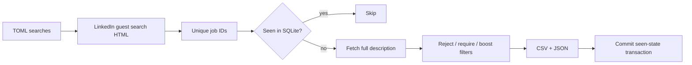

## Summary

- Add an HTTP-first daily LinkedIn job indexer using public guest HTML endpoints.
- Deduplicate jobs in SQLite, fetch full descriptions, filter deterministically, and export ranked CSV/JSON results.
- Add tests, CI, documentation, and a scheduled/manual GitHub Actions workflow.

## System flow

## Validation

- `ruff check .`
- `mypy`
- `pytest`
- package wheel build
- bounded live guest-endpoint smoke test where network access is available

## Limitations

LinkedIn's guest endpoints are undocumented, best-effort, potentially incomplete, and may block cloud-hosted traffic. The program fails visibly on detected block pages instead of treating them as zero results.
